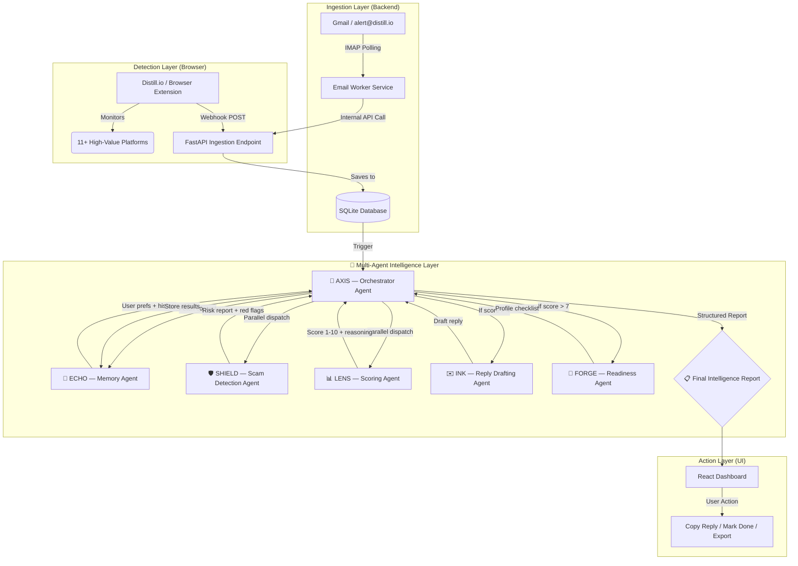
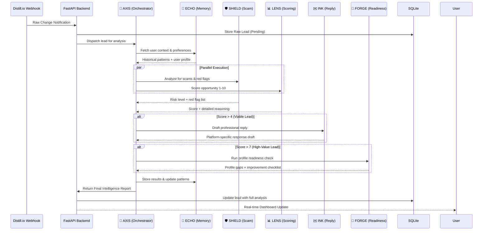

# ⚡ Job Intel AI — The Ultimate Career Command Center

**Job Intel AI** is a cutting-edge, real-time automation system designed for elite **Students**. It transforms the chaotic noise of job alerts and freelance inquiries into a prioritized, high-signal stream of actionable opportunities, using a **Multi-Agent LLM Architecture** — a coordinated fleet of 7 specialized AI agents — to detect scams, score opportunities, and draft ready-to-send professional responses.

---

## 🏗️ Multi-Agent System Architecture

The system is composed of **7 specialized AI agents**, each owning a distinct responsibility. **AXIS**, the Orchestrator Agent, coordinates all agents, manages task delegation, and assembles the final intelligence report.



---

## 🤖 Agent Roster

| Agent | Codename | Role | Responsibility |
|---|---|---|---|
| 🧠 **Orchestrator Agent** | `AXIS` | Master Controller | Routes tasks, manages agent lifecycle, assembles the final report |
| 📡 **Ingestion Agent** | `PULSE` | Data Collector | Normalizes raw webhook/email data into a structured schema |
| 🛡️ **Scam Detection Agent** | `SHIELD` | Risk Auditor | Scans for red flags, suspicious patterns, and blacklisted behaviors |
| 📊 **Scoring Agent** | `LENS` | Opportunity Analyst | Scores leads 1–10 based on profile alignment, value & strategy |
| ✉️ **Reply Drafting Agent** | `INK` | Communications Expert | Generates personalized, platform-specific professional responses |
| 🚀 **Readiness Agent** | `FORGE` | Career Coach | Audits LinkedIn/GitHub, suggests improvements for high-value leads |
| 💾 **Memory Agent** | `ECHO` | Context Keeper | Persists user preferences, learns patterns across sessions |

> **Agent Tier Strategy**: AXIS handles complex orchestration reasoning at the highest capability tier. SHIELD, LENS, and INK handle nuanced analysis and writing at the mid tier. PULSE, FORGE, and ECHO handle fast, lightweight utility tasks at the speed tier — keeping the system efficient and cost-effective.

---

## 🧪 Multi-Agent Intelligence Flow



---

## 🧠 Core Features

This is not just another job tracker. It's a **fleet of intelligent agents** working 24/7 in parallel.

### 1. 🛡️ SHIELD — Scam Detection Agent
Every opportunity is automatically audited for potential "Red Flags."
- **Detection criteria**: Unusual hourly rates, requests for free work, generic templates, high-pressure tactics, or known scam patterns.
- **Output**: A clear, bulleted list of warnings with a `Low / Medium / High` risk rating.

### 2. 📊 LENS — Scoring Agent
Not all leads are created equal. Scoring logic is based on:
- **Alignment**: How well the role fits an AI Engineer profile.
- **Value**: Estimated contract value or strategic importance.
- **Reasoning**: A detailed explanation of the priority score (1–10).

### 3. ✉️ INK — Reply Drafting Agent
Stop staring at a blank screen. INK generates professional, contextual replies for every lead.
- **Customized**: References specific project details from the alert.
- **Platform-aware**: Adapts tone and format for LinkedIn, Upwork, Email, etc.
- **Copy-Paste Ready**: One-click copying directly from the dashboard.

### 4. 🚀 FORGE — Readiness Agent
The system proactively ensures you are ready for the opportunity:
- **Checklist**: "Is your LinkedIn/GitHub/Landing Page optimized for this specific client?"
- **Guidance**: For high-value leads (score > 7), FORGE suggests targeted improvements before you hit send.

### 5. 💾 ECHO — Memory Agent
The system learns and improves over time:
- **Preference Learning**: Remembers your preferences (e.g., preferred rate range, avoided client types).
- **Pattern Recognition**: Identifies which opportunity types convert best for your profile.
- **Cross-Session Context**: Every new lead is analyzed with the full weight of your history.

---

## 🔄 Agent Communication Protocol

Agents communicate via a structured **internal message schema**:

```json
{
  "task_id": "uuid-v4",
  "source_agent": "AXIS",
  "target_agent": "SHIELD",
  "payload": {
    "lead_content": "Raw opportunity text...",
    "platform": "upwork",
    "timestamp": "2025-07-10T14:30:00Z"
  },
  "context": {
    "user_profile": "AI Engineer, 3 years exp...",
    "historical_patterns": ["prefers async roles", "avoids < $50/hr"]
  }
}
```

**AXIS** collects all agent responses and assembles the **Final Intelligence Report**:

```json
{
  "lead_id": "uuid-v4",
  "platform": "upwork",
  "analysis": {
    "agent_shield": {
      "risk_level": "Low",
      "red_flags": []
    },
    "agent_lens": {
      "opportunity_score": 8.4,
      "score_reasoning": "Strong alignment with AI engineering profile..."
    },
    "agent_ink": {
      "suggested_reply": "Hi [Name], I'd love to discuss your ML pipeline project..."
    },
    "agent_forge": {
      "readiness_checklist": [
        "✅ LinkedIn profile is up to date",
        "⚠️  Add recent RAG project to GitHub",
        "✅ Portfolio landing page is live"
      ]
    }
  }
}
```

---

## 🏗️ Technical Implementation

### Backend: The Engine
- **FastAPI**: Asynchronous, high-performance API routing.
- **IMAP Worker**: Dedicated `email_worker.py` running every 20 seconds for zero-latency detection.
- **SQLAlchemy**: Robust ORM for persistent data management.
- **LLM SDK**: Powers the full agent fleet — AXIS, SHIELD, LENS, INK, FORGE, PULSE, and ECHO.
- **Async Agent Dispatcher**: Parallel agent execution via `asyncio.gather()` for maximum speed.

### Frontend: The Command Center
- **React.js (Vite)**: Lightning-fast development and optimized build.
- **Mermaid.js Integration**: For architectural transparency.
- **Custom CSS**: A high-end, professional "Command Center" aesthetic with dark-espresso accents and parchment-cream backgrounds.

### Agent Execution Model
```
AXIS (Orchestrator)
├── [Sequential]  ECHO    → Fetch context
├── [Parallel]    SHIELD  → Risk analysis
├── [Parallel]    LENS    → Opportunity score
├── [Conditional] INK     → Draft reply   (if score > 4)
├── [Conditional] FORGE   → Profile check (if score > 7)
└── [Sequential]  ECHO    → Store results
```

---

## 📡 Supported Platforms (The Big 11)
- **Networking**: LinkedIn, Bluesky, DEV Community
- **Freelance**: Upwork, Fiverr, Freelancer
- **Job Boards**: ZipRecruiter, SimplyHired, Glassdoor
- **Specialized**: Kaggle (Competitions), Google Scholar (Research alerts)

---

## 🚀 One-Command Launch
Launch the entire ecosystem (Backend, Frontend, and Worker) in seconds:
```bash
bash start.sh
```

---

## 🗺️ Multi-Agent Upgrade Roadmap

| Phase | Agent | Status |
|---|---|---|
| ✅ Phase 1 | Single-agent analysis (legacy) | Complete |
| 🔄 Phase 2 | AXIS + SHIELD + LENS | In Progress |
| 🔜 Phase 3 | INK + FORGE | Planned |
| 🔜 Phase 4 | ECHO — cross-session learning | Planned |
| 🔜 Phase 5 | DEAL — Negotiation Agent (counter-offer advisor) | Planned |
