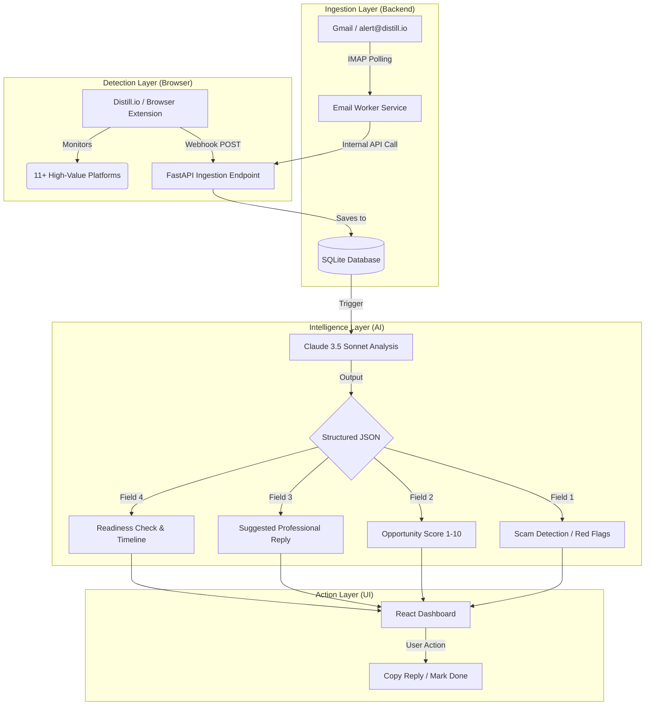
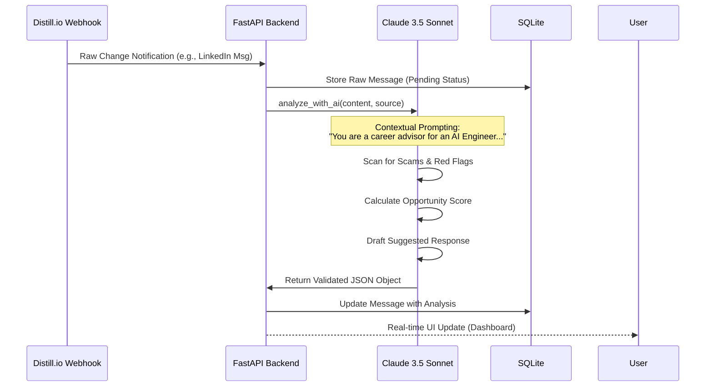

# ⚡ Job Intel AI — The Ultimate Career Command Center

**Job Intel AI** is a cutting-edge, real-time automation system designed for elite **Student**. It transforms the chaotic noise of job alerts and freelance inquiries into a prioritized, high-signal stream of actionable opportunities, using advanced **LLM-driven intelligence** (Claude 3.5 Sonnet) to detect scams, score opportunities, and draft ready-to-send professional responses.

---

## 🏗️ System Architecture

The following diagram illustrates the seamless flow from raw web change detection to actionable intelligence.



---

## 🧠 Core Features

This is not just another job tracker. It's an **intelligent agent** working 24/7.

### 1. 🛡️ Integrated Scam & Risk Detection
Every opportunity is automatically audited by the AI for potential "Red Flags."
- **Detection criteria**: Unusual hourly rates, suspicious request for free work, generic templates, or high-pressure tactics.
- **Output**: A clear, bulleted list of warnings to help you avoid time-wasters.

### 2. 📊 Opportunity Scoring (1-10)
Not all leads are created equal. The system uses a proprietary scoring logic based on:
- **Alignment**: How well the role fits an AI Engineer profile.
- **Value**: Estimated contract value or strategic importance.
- **Reasoning**: A detailed explanation of why the lead was given a specific priority.

### 3. ✉️ Instant "Ready-to-Send" Replies
Stop staring at a blank screen. The AI generates professional, contextual replies for every lead.
- **Customized**: It references specific project details from the alert.
- **Copy-Paste Ready**: One-click copying to LinkedIn, Upwork, or Email.

### 4. 🚀 Professional Readiness Check
The system proactively ensures you are ready for the opportunity:
- **Checklist**: "Do you have your LinkedIn/GitHub/Landing Page ready for this specific client?"
- **Guidance**: If the lead is high-value, it suggests specific improvements to your professional presence before you hit send.

---

## 🧪 Intelligence Logic Flow



---

## 🛠️ Technical Implementation

### Backend: The Engine
- **FastAPI**: Asynchronous, high-performance API routing.
- **IMAP Worker**: Dedicated [email_worker.py](file:///d:/Project/Hack/Raef/job-intel-ai/job-intel-clean/backend/email_worker.py) running every 20 seconds for zero-latency detection.
- **SQLAlchemy**: Robust ORM for persistent data management.
- **Anthropic SDK**: Leveraging the power of `claude-3-5-sonnet-20240620`.

### Frontend: The Command Center
- **React.js (Vite)**: Lightning-fast development and optimized build.
- **Mermaid.js Integration**: For architectural transparency.
- **Custom CSS**: A high-end, professional "Command Center" aesthetic with dark-espresso accents and parchment-cream backgrounds.

---

## 📡 Supported Platforms (The Big 11)
- **Networking**: LinkedIn, Bluesky, DEV Community
- **Freelance**: Upwork, Fiverr, Freelancer
- **Job Boards**: ZipRecruiter, SimplyHired, Glassdoor
- **Specialized**: Kaggle (Competitions), Google Scholar (Research alerts)

---

## 🚀 One-Command Launch
Launch the entire ecosystem (Backend, Frontend, and Worker) in seconds:
```bash
bash start.sh
```

